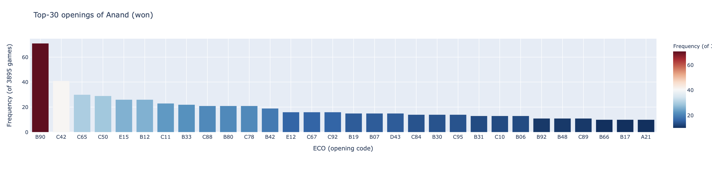

<!--
*** Thanks for checking out this README Template. If you have a suggestion that would
*** make this better, please fork the repo and create a pull request or simply open
*** an issue with the tag "enhancement".
*** Thanks again! Now go create something AMAZING! :D
-->


<!-- PROJECT SHIELDS -->
<!--
*** I'm using markdown "reference style" links for readability.
*** Reference links are enclosed in brackets [ ] instead of parentheses ( ).
*** See the bottom of this document for the declaration of the reference variables
*** for contributors-url, forks-url, etc. This is an optional, concise syntax you may use.
*** https://www.markdownguide.org/basic-syntax/#reference-style-links
-->
[![Contributors][contributors-shield]][contributors-url]
[![Forks][forks-shield]][forks-url]
[![Stargazers][stars-shield]][stars-url]
[![Issues][issues-shield]][issues-url]
[![MIT License][license-shield]][license-url]
[![LinkedIn][linkedin-shield]][linkedin-url]


<!-- PROJECT LOGO -->
<br />
<p align="center">
  <a href="https://github.com/inotin/pgnstats">
    
  </a>

  <h3 align="center">PGN Stats</h3>

  <p align="center">
    This projects is devoted to finding out the most popular openings among famous chess players
    <br />
    <a href="https://github.com/othneildrew/Best-README-Template"><strong>Explore the docs »</strong></a>
    <br />
    <br />
    <a href="https://github.com/inotin/reviewAnalyzer">View Demo</a>
    ·
    <a href="https://github.com/inotin/reviewAnalyzer/issues">Report Bug</a>
    ·
    <a href="https://github.com/inotin/reviewAnalyzer/issues">Request Feature</a>
  </p>
</p>


<!-- TABLE OF CONTENTS -->
## Table of Contents

* [About the Project](#about-the-project)
* [Getting Started](#getting-started)
  * [Prerequisites](#prerequisites)
  * [Installation](#installation)
* [Usage](#usage)
* [Roadmap](#roadmap)
* [Contributing](#contributing)
* [License](#license)
* [Contact](#contact)
* [Acknowledgements](#acknowledgements)


<!-- ABOUT THE PROJECT -->
## About The Project

<!-- [![Product Name Screen Shot][product-screenshot]](https://example.com). -->

### To Do List
- [x] Make initial commit
- [x] Add comments to the functions
- [x] Optimize downloading of PGNs
- [x] Add graphical representation of obtained stats
- [x] Add ELO descriptions to the chart
- [x] Update README.md.
- [ ] Integrate a chess board for visualizing an opening by click of a bar in the barchart
- [ ] Create predictive models to imitate a certain player

<!-- GETTING STARTED -->
## Getting Started

This is an example of how you may give instructions on setting up your project locally.
To get a local copy up and running follow these simple example steps.

### Prerequisites

Just install the requirements

```sh
pip install -r requirements.txt
```

### Installation

1. Clone the repo
```sh
git clone https://github.com/inotin/pgnstats.git
```
2. Install the requirements
```sh
pip install -r requirements.txt
```


<!-- USAGE EXAMPLES -->
## Usage

If you want to get the info on top 30 openings of Anand when he won use:
```sh
python pgnstats.py anand 30 won
```
You'll find the formed barchart in ./outputs/graph.html
<p align="center">
    
</p>


<!-- ROADMAP -->
## Roadmap

See the [open issues](https://github.com/inotin/pgnstats/issues) for a list of proposed features (and known issues).


<!-- CONTRIBUTING -->
## Contributing

Contributions are what make the open source community such an amazing place to be learn, inspire, and create. Any contributions you make are **greatly appreciated**.

1. Fork the Project
2. Create your Feature Branch (`git checkout -b feature/AmazingFeature`)
3. Commit your Changes (`git commit -m 'Add some AmazingFeature'`)
4. Push to the Branch (`git push origin feature/AmazingFeature`)
5. Open a Pull Request


<!-- LICENSE -->
## License

Distributed under the MIT License. See `LICENSE` for more information.


<!-- CONTACT -->
## Contact

Ilia Notin - notin13@gmail.com

Project Link: [https://github.com/inotin/pgnstats](https://github.com/inotin/pgnstats)


<!-- ACKNOWLEDGEMENTS -->
## Acknowledgements
* [Automatic requirment.txt creation](https://github.com/Damnever/pigar)
* [The used Readme template](https://github.com/othneildrew/Best-README-Template)


<!-- MARKDOWN LINKS & IMAGES -->
<!-- https://www.markdownguide.org/basic-syntax/#reference-style-links -->
[contributors-shield]: https://img.shields.io/github/contributors/inotin/pgnstats.svg?style=flat-square
[contributors-url]: https://github.com/inotin/pgnstats/graphs/contributors
[forks-shield]: https://img.shields.io/github/forks/inotin/pgnstats.svg?style=flat-square
[forks-url]: https://github.com/inotin/pgnstats/network/members
[stars-shield]: https://img.shields.io/github/stars/inotin/pgnstats.svg?style=flat-square
[stars-url]: https://github.com/inotin/pgnstats/stargazers
[issues-shield]: https://img.shields.io/github/issues/inotin/pgnstats.svg?style=flat-square
[issues-url]: https://github.com/inotin/pgnstats/issues
[license-shield]: https://img.shields.io/github/license/inotin/pgnstats.svg?style=flat-square
[license-url]: https://github.com/inotin/pgnstats/blob/master/LICENSE.txt
[linkedin-shield]: https://img.shields.io/badge/-LinkedIn-black.svg?style=flat-square&logo=linkedin&colorB=555
[linkedin-url]: https://www.linkedin.com/in/inotin/
[product-screenshot]: images/screenshot.png
[graph]: images/anand30won.png
